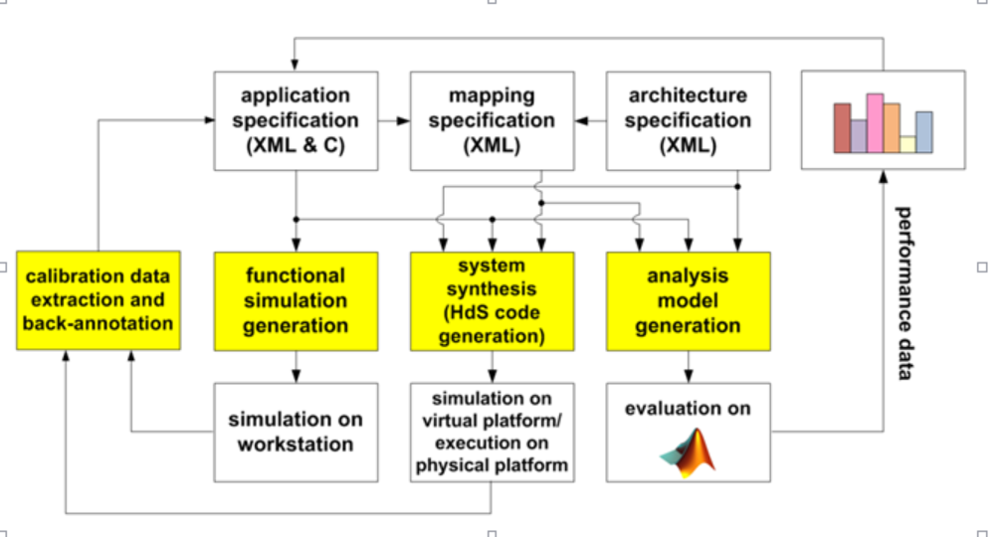
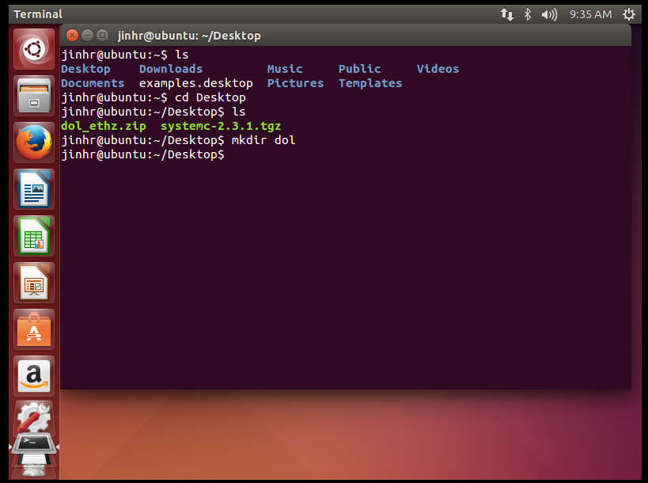
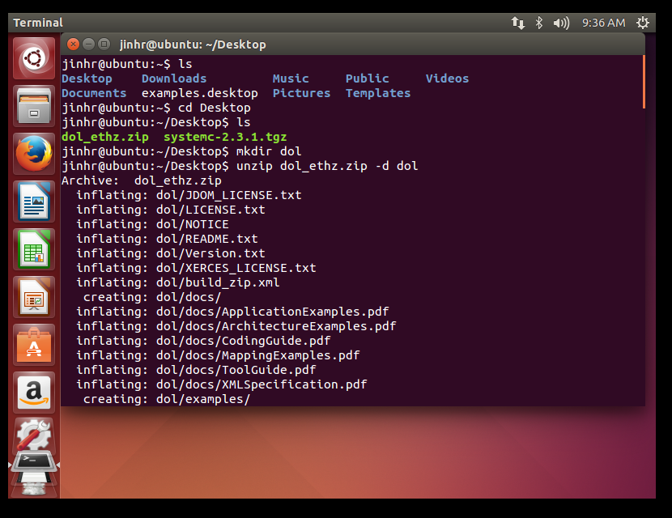
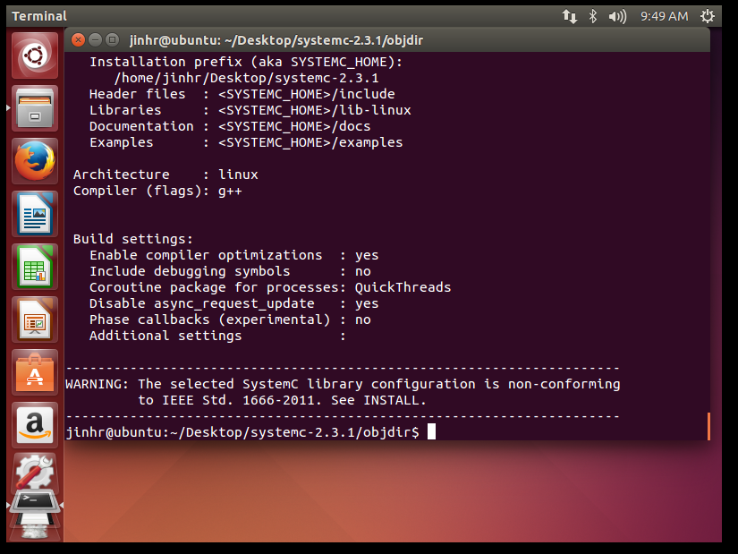
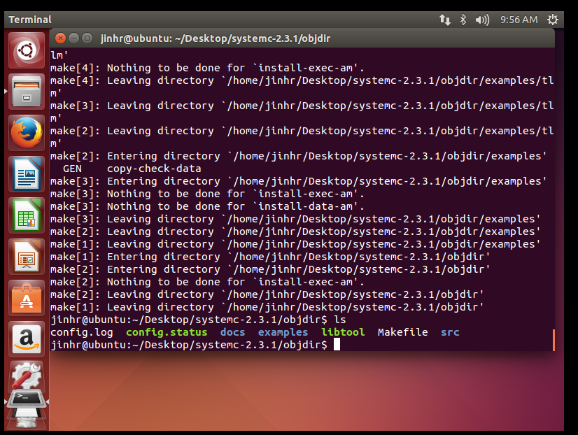
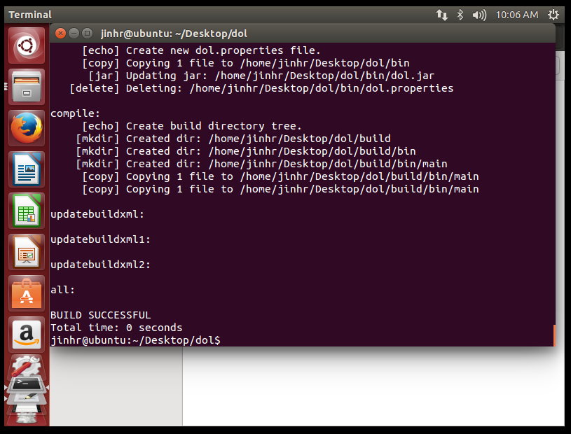
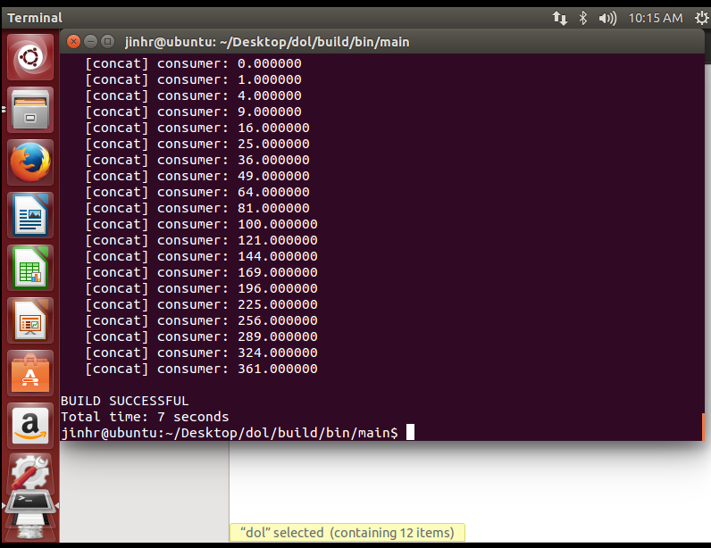

# Lab1: DOL开发环境配置


- **DOL 框架（Distributed Operation Layer ）描述: **
 
The distributed operation layer (DOL) is a software development framework to program parallel applications. The DOL allows to specify applications based on the Kahn process network model of computation and features a simulation engine based on SystemC. Moreover, the DOL provides an XML-based specification format to describe the implementation of a parallel application on a multi-processor systems, including binding and mapping.



- **如何安装（How to install）** ：

- **1** 下载文件(使用Vmware虚拟机，也可以从主机拷贝到虚拟机中去* * http://jingyan.baidu.com/article/c33e3f48a5c153ea15cbb5b2.html
)：
sudo wget http://www.accellera.org/images/downloads/standards/systemc/systemc-2.3.1.tgz

sudo wget http://www.tik.ee.ethz.ch/~shapes/downloads/dol_ethz.zip 
- **2** ：解压文件
	* `新建 dol的文件夹  (图 1 )`
	* `$	mkdir dol   `
	* `将dolethz.zip解压到 dol文件夹中  （图 2）`
	* `$	unzip dol_ethz.zip -d dol`
	* `解压systemc  $	tar -zxvf systemc-2.3.1.tgz`
	* `编译systemc`
	* `解压后进入systemc-2.3.1的目录下`
	* `$	cd systemc-2.3.1`
	* `新建一个临时文件夹objdir`
	* `$	mkdir objdir`
	* `进入该文件夹objdir`
	* `$	cd objdir`
	* `运行configure(能根据系统的环境设置一下参数，用于编译) （图 3 ）`
	* `$	../configure CXX=g++ --disable-async-updates`
	* `编译`
	* `$	sudo make install`
	* `记录当前的工作路径(会输出当前所在路径，记下来，待会有用)`
	* `$	pwd`
- **3:**3.编译dol
	* `进入刚刚dol的文件夹`
	* `$	cd ../dol`
	* `修改build_zip.xml文件`
	* `找到下面这段话，就是说上面编译的systemc位置在哪里，`
	* `<property name="systemc.inc" value="YYY/include"/>`
	* `<property name="systemc.lib" value="YYY/lib-linux/libsystemc.a"/>`
	* `把YYY改成上页pwd的结果（注意，对于  64位 系统的机器，lib-linux要改成lib-linux64）`
	* `然后是编译`
	* `$	ant -f build_zip.xml all （图 4 ）`
	* `若成功会显示build successful`
	* `接着可以试试运行第一个例子`
	* `进入build/bin/mian路径下 （ 图 5 ）`
	* `$	cd build/bin/main`
	* `然后运行第一个例子 （图 6 ）`
	* `$	ant -f runexample.xml -Dnumber=1`

* 图 1

* 图 2

* 图 3

* 图 4

* 图 5

* 图 6


- **实验心得（Experimental experience）：**

* ```本次实验主要是完成了对虚拟机的DOL开发环境的配置。在配置过程中，主要出现了以下几个问题：```
* ```安装ubuntu的时，一开始安装的是64位的，结果导致无法将主机文件直接移到虚拟机中，因此重新安装至32位的ubuntu才解决。```
* ```配置dol文件时，电脑出现了错误，百度错误之后，加上sudo apt-get install build-essential这句指令后才顺利执行```
* ```本次实验最大的体会是遇到问题要自己想办法解决，或百度，或查找其他资料。不要着急向别人询问答案。当自己解决后，感觉会更好。```
