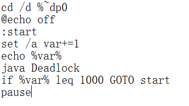
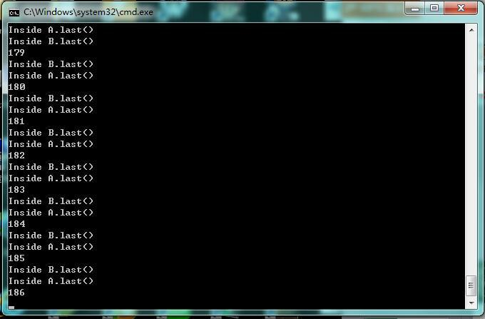

#Lab4：Deadlock

1、首先我们写Deadlock.java 。这个里面包含了类A，类B和 类 Deadlock(来实现Runnable).在这里我将count的值设为5000（已经用红色字体标注）来实现死锁。

class A{
	synchronized void methodA(B b){
		b.last();
	}
	synchronized void last(){
		System.out.println("Inside A.last()");
	}
}

class B{
	synchronized void methodB(A a){
		a.last();
	}
	synchronized void last(){
		System.out.println("Inside B.last()");
	}
}
class Deadlock implements Runnable{
	A a=new A();
	B b=new B();

	Deadlock(){
		Thread t=new Thread(this);
		int count=5000;

		t.start();
		while(count-->0);
		a.methodA(b);
	}
	public void run(){
		b.methodB(a);
	}
	public static void main(String args[]){
		new Deadlock();
	}
}

2、运行 javac Deadlock.java ，可以得到三个类， A.class, B.class, Deadlock.class .如下图所示

在上面这个图中，deadlock.bat文件是要在windows下运行的批量处理文件。它的内容为

这个表示文件运行1000次会自动停止，但是由于死锁，它会在中间停止。
3、点击deadlock.bat后，运行结果为

#回答问题：

**1、**死锁截图如上所示
**2、产生死锁的四个条件：**
2.1、互斥  
2.2、不可强占
2.3、请求和保持 
2.4、循环等待 
**3、**这个实验出现死锁的原因是，当a.methodA(b) 与 b.methodB(a)运行时，当当一个线程访问object的一个synchronized同步代码块或同步方法时，其他线程对object中所有其它synchronized同步代码块或同步方法的访问将被阻塞。

