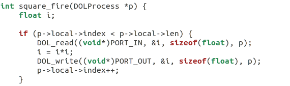
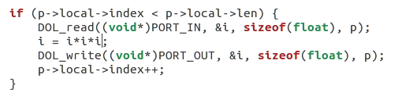
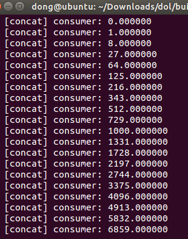
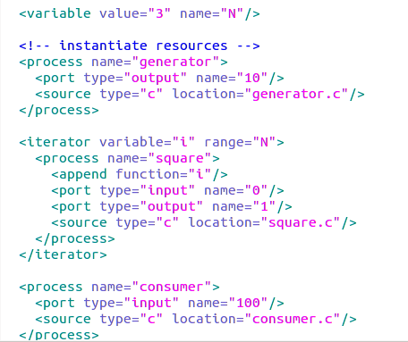
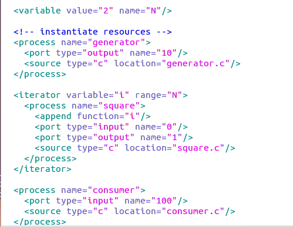
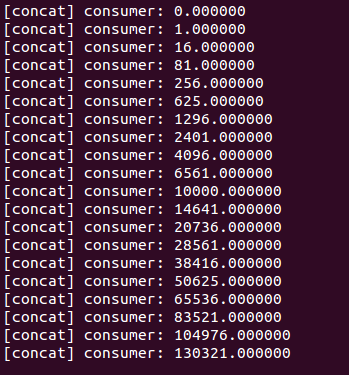

#Lab3: DOL 实例分析&编程
**1、这次实验的第一个任务是要修改example1，使其输出3次方数。**提示说需要去看square.c因此我们先看一下square.c的代码，如下

**2、**代码不多，需要改的地方更少。我们可以看到这份代码中将i 变成了i*i。这里就是我们要修改的地方。我们**只需要将i = i * i 改为 i = i * i * i**就可以了。改完代码后我们来看一下现在的square.c

**3、**接下来就是跑一下我们的测试程序，结果如下。

**4、接下来进行第二个任务，修改example2，让3个square模块变成2个**。按	照提示i，我们要修改xml中的iterator.首先我们还是要先看一下代码，代码如	下

**5、**通过分析上面的代码可以知道，**决定有多少个square的是代码中的value的值，此时是3，我们只需要将其改为2即可**。修改完的代码如下

**6、**运行修改完的代码，得到结果为：

**7、实验感想**
本次实验总体来说比较简单，修改的代码很少。不过我认为本次实验的目的不是让我们去修改代码，而是让我们去学习如何修改代码，去学习在哪里修改代码，去学习分析代码等。我修改那个代码只用了几秒钟，但是我思考该修改它思考了好久，这个思考过程或许才是实验需要的。
总而言之，实验还是比较顺利的。
