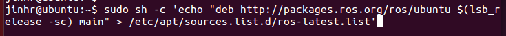
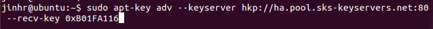
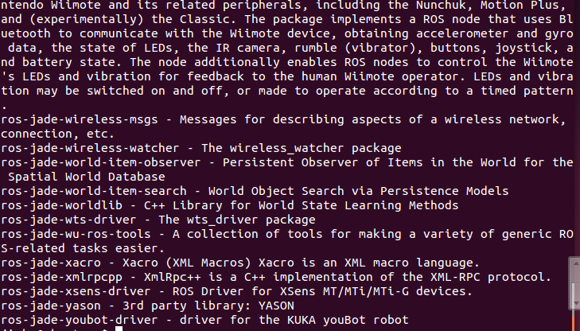

# Lab5:ROS配置

**1、**sudo sh -c 'echo "deb http://packages.ros.org/ros/ubuntu $(lsb_release -sc) main" > /etc/apt/sources.list.d/ros-latest.list'

**2、**sudo apt-key adv --keyserver hkp://ha.pool.sks-keyservers.net:80 --recv-key 0xB01FA116

**3、**sudo apt-get update

**4、**sudo apt-get install ros-jade-desktop-full

**5、查看可得到的包**
apt-cache search ros-jade

**6、初始化rosdep**
sudo rosdep init

rosdep update

**7、**
echo "source /opt/ros/jade/setup.bash" >> ~/.bashrc

source ~/.bashrc

**8、得到 rosinstall**
sudo apt-get install python-rosinstall

**9、实验心得**：
这次实验比较简单，基本上就是按照网页上的教程，一步一步配置过来的。中间基本没有出错，因此实验的新的体会不是很多。下面休整一下，准备接下来的应用。

